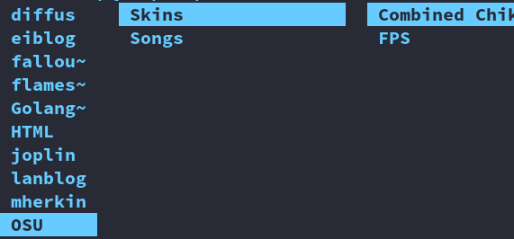
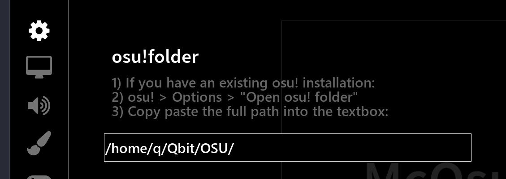
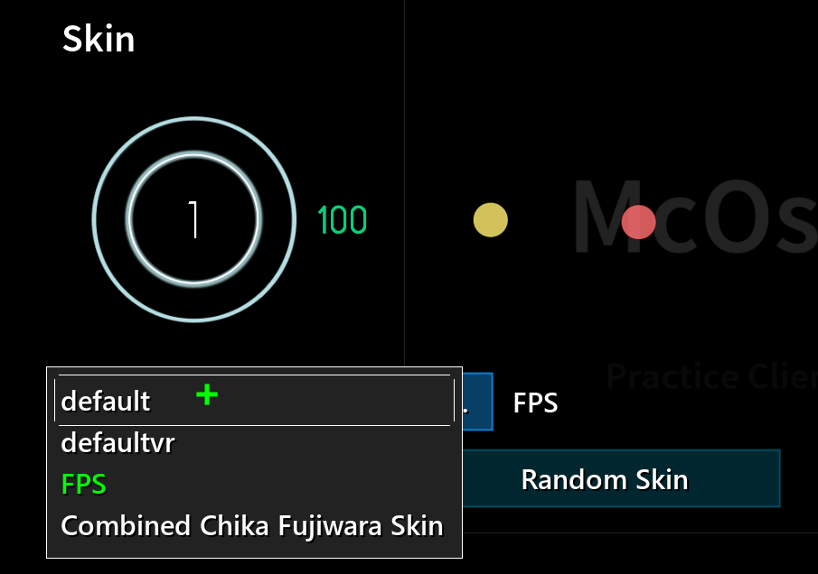

## Folder Structure & McOsu Configuration
Whether windows, linux  or macos, McOsu's folder sturcture is same.

1. Create folders with picture, you have to create an osu folder, of course you can take other names.
2. Inside this folder, create  "Songs" folder and "Skins" folder for osu to read, These two folder names cannot be changed.

Options > osu!folder > paste the full patch into the text box.

## Adding Beatmaps & Skins
McOsu cannot be imported Beatmaps & Skins like Osu, you need extract Beatmaps & Skins to a asparate folder.
### Adding Beatmaps
1. Download beatmaps from https://osu.ppy.sh/beatmapsets
2. Create a new subfolder inside 'Songs' folder, preferably with the beatmap filename without spaces.Of cours it's not necessary, it's just easy to organize.
3. Extract the Beatmaps in 'zip format ' to subfolder, if you use linux, following command:`unzip -d [subfolder] [beatmaps]`
4. If McOsu is running, you can press 'F5' while you are in the songbrowser to reload beatmaps, you can also restart McOsu.

Of course, this process is boring, so I prepared a [script](Songs/song.sh) for this. this  [script](Songs/song.sh) will extract all Beatmaps under the Songs to their own subfolder. Unfortunately, it doesn't work on Windows.

### Adding Skins
Similary, the skin should have its own subfolder inside the 'Songs' folder.

Skin > Local Skin 
If your McOsu is Steam version, you can easily subscribe form the workshop.
